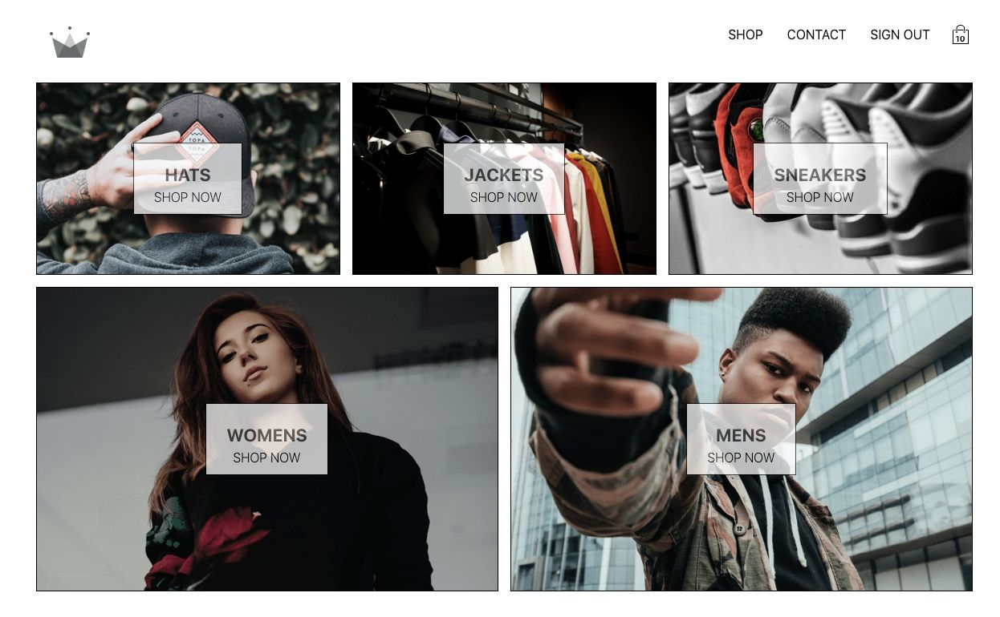
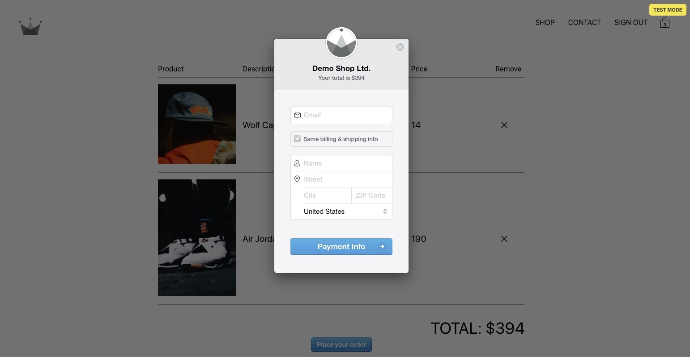

# react-ecommerce-clothing

## Description

eCommerce clothing website.
Integrate with Stripe to make payment.

**_DEMO:_**

Top-page <br>


Checkout <br>


## Usage / Install

Clone repo, cd into folder and run:

```console
$ yarn
$ yarn start
```

## Requirement

- yarn / npm

## Tools

- Create-react-app cli
- SCSS
- Styled-components: Write css in JS and gives random class name to make scalable app
- React Router v5
- Firebase (Google OAuth)
- Firestore
- Redux
- Redux-logger: Logging every actions
- Redux-persist: To cash data in local storage
- Redux-thunk: Allow to fire functions
- Reselect: To update states for only affected states
- React-stripe-checkout

## Licence

[MIT](./LICENSE.txt)

